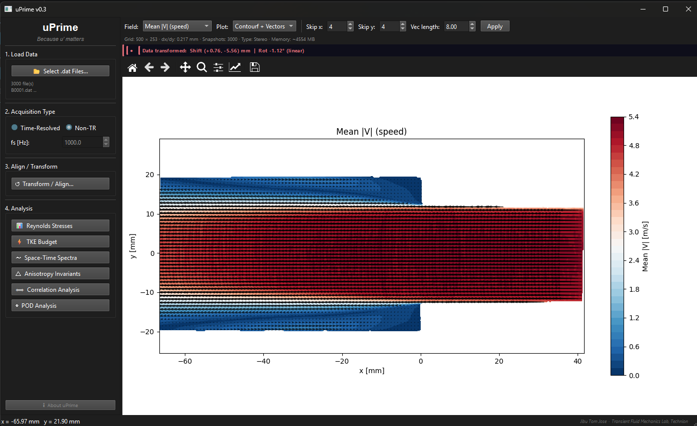

# uPrime

[](https://doi.org/10.5281/zenodo.19376184)


### *Because u′ matters*

<p align="center">
  
</p>

**uPrime** is a standalone software for post-processing and analysis of velocity field data from PIV and CFD. It provides a unified graphical interface to perform turbulence analysis without scripting, integrating multiple workflows into a single environment.

Originally developed for Particle Image Velocimetry (PIV), uPrime is equally applicable to CFD and other structured velocity datasets. It is designed to handle large, high-resolution, and time-resolved datasets commonly encountered in modern fluid mechanics research.

Currently supports **planar (2D2C)** and **stereo (2D3C)** velocity fields.

---

## 🚀 Installation

### Windows (recommended)

Download the latest executable from:  
https://github.com/CmdrRyder/uPrime/releases

No installation required.

> Windows Defender may flag the `.exe` on first run. Click **More info → Run anyway**.

---

### Run from source

```bash
git clone https://github.com/CmdrRyder/uPrime.git
cd uPrime
pip install -r requirements.txt
python main.py
```
---

## ⚡ Quick Start

1. Launch uPrime
2. Select `.dat` files
3. Choose **Time-Resolved** or **Non-TR**
4. Inspect fields in the viewer
5. Apply **Align / Transform** if needed
6. Open analysis modules

---

## 🔬 Analysis Modules

- Reynolds stress tensor and profiles
- Turbulent kinetic energy (TKE) and budget terms
- Spatial, temporal, and space-time spectral analysis
- Two-point correlations and integral scales
- Anisotropy invariants (Lumley triangle, barycentric map)
- Proper Orthogonal Decomposition (POD)

---

## ⭐ Key Features

- **Standalone executable**: no setup required
- **User-friendly GUI**: no scripting needed
- **Unified workflow**: multiple analyses in one place
- **PIV + CFD compatible**: any structured velocity data
- **Handles large datasets**: time-resolved and high-resolution
- **Alignment tools**: rotation and shifting for PIV calibration issues

---

## 📊 Example Results

### Reynolds Stress

<p align="center">
  
</p>

### Space-Time Spectra

<p align="center">
  
</p>

---

## 📂 Input Format

uPrime reads **Tecplot ASCII `.dat` files**:

```
TITLE = "filename"
VARIABLES = "x [mm]", "y [mm]", "Velocity u [m/s]", "Velocity v [m/s]", ...
ZONE T="Frame 0", I=NX, J=NY, F=POINT
...data...
```

- Multiple files can be loaded as a time series
- Automatic column detection
- Supports 2D and stereo data

Compatible with **DaVis** and CFD exports.

---

## 📘 Documentation

📄 [uPrime User Manual](docs/manual.pdf)

Includes:
- module descriptions
- workflows
- implementation notes

---

## 🧠 Development Status

uPrime is under active development (**v0.3 alpha**).  
Core analysis modules are stable, while additional features are being refined.

---

## 🧭 Development Philosophy

uPrime is developed and maintained at the **Transient Fluid Mechanics Laboratory (TFML), Technion**.

To ensure consistency and reliability, extensions are encouraged to be integrated into the main repository rather than maintained as separate forks.

---

## 🛣️ Roadmap

- [ ] FTLE
- [ ] DMD
- [ ] SPOD
- [ ] Phase averaging
- [ ] macOS / Linux builds
- [ ] Tomographic data support
---

## 📖 Citation

If uPrime contributes to your research, please be kind and cite us:
Jose, J. T., & Ram, O. (2026). uPrime : Open-source software for velocity field and turbulence analysis from PIV and CFD data. (v0.3.3-alpha). TFML, Technion (v0.3.3-alpha). Zenodo.  https://doi.org/10.5281/zenodo.19376184

---

## 📜 License

This project is licensed under the GNU General Public License v3.0 (GPLv3).

https://www.gnu.org/licenses/gpl-3.0.en.html

---

## 👤 Author

**Jibu Tom Jose**  
Postdoctoral Research Fellow  
Technion — Israel Institute of Technology

Built with assistance from [Claude](https://www.anthropic.com) (Anthropic).
