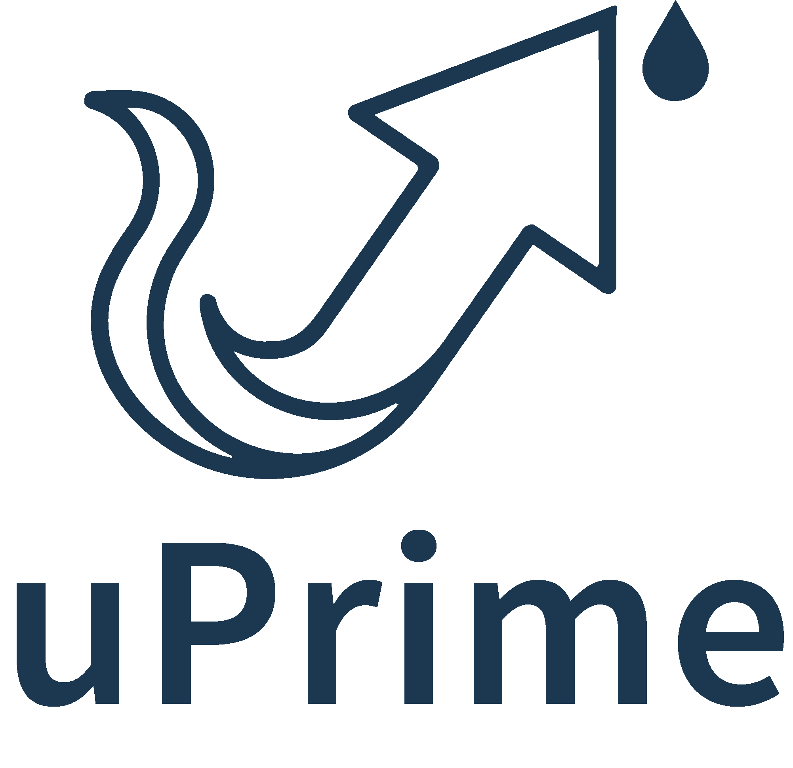
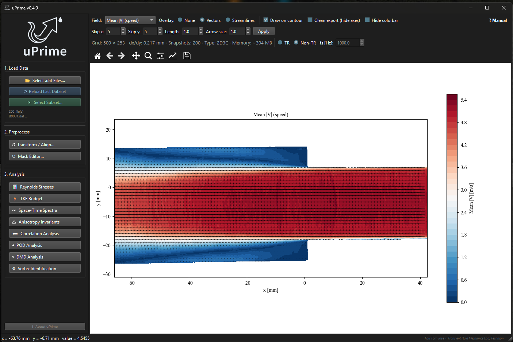
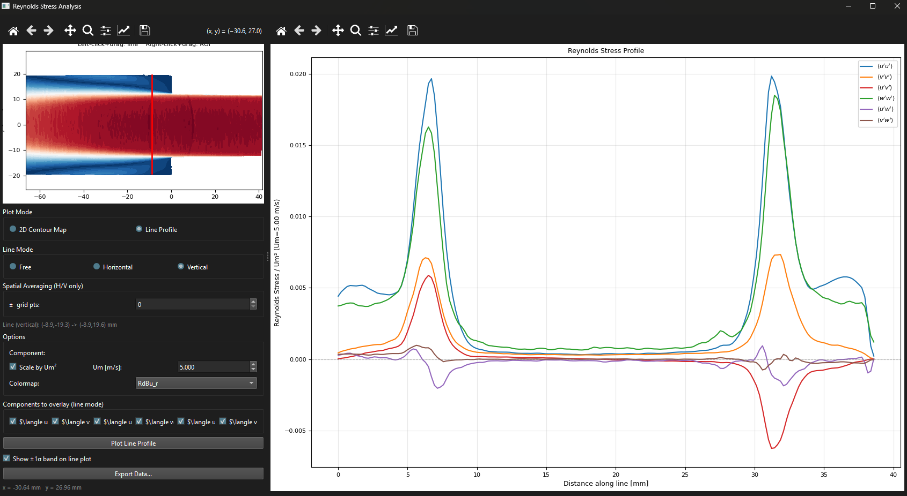
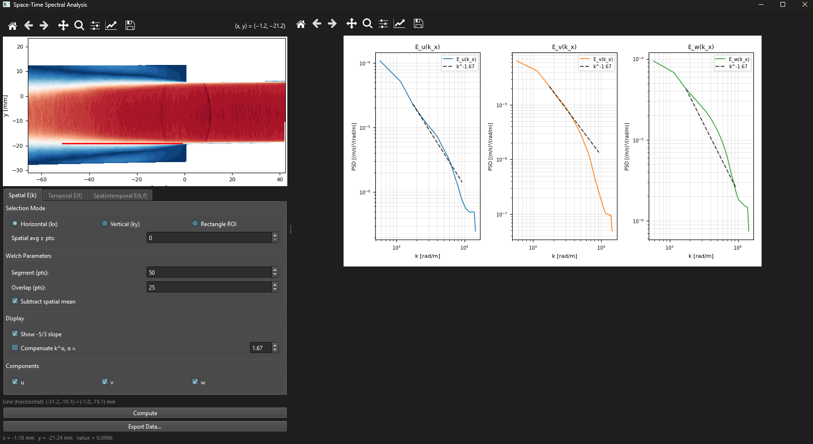

# uPrime

[](https://doi.org/10.5281/zenodo.19376184)


### *Because u′ matters*

<p align="center">
  <picture>
    <source media="(prefers-color-scheme: dark)" srcset="assets/logo_dark.png">
    <source media="(prefers-color-scheme: light)" srcset="assets/logo.png">
    
  </picture>
</p>

<p align="center">
  
</p>

**uPrime** is a standalone desktop application for post-processing and turbulence analysis of velocity field data from PIV and CFD. It provides a unified graphical interface covering the full range of standard turbulence diagnostics — from Reynolds stresses to DMD — without requiring any scripting or programming knowledge.

Originally developed for Particle Image Velocimetry (PIV), uPrime is equally applicable to CFD and other structured velocity datasets. It is designed to handle large, high-resolution, and time-resolved datasets commonly encountered in modern fluid mechanics research.

Currently supports **planar (2D2C)** and **stereo (2D3C)** velocity fields.

---

## 🚀 Installation

### Windows (recommended)

Download the latest executable from:
https://github.com/CmdrRyder/uPrime/releases

No installation required. Double-click to launch.

> Windows Defender may flag the `.exe` on first run. Click **More info → Run anyway**.

---

### Run from source

```bash
git clone https://github.com/CmdrRyder/uPrime.git
cd uPrime
pip install -r requirements.txt
python main.py
```

---

## ⚡ Quick Start

1. Launch uPrime
2. Select `.dat` files -- a subsampling dialog appears for large datasets
3. Set **Time-Resolved** or **Non-TR** and enter $f_s$ if TR
4. Apply **Transform / Align** to correct camera tilt and shift origin
5. Draw masks in **Mask Editor** if needed
6. Open any analysis module from the sidebar

---

## 🔬 Analysis Modules

| Module | Description | TR required |
|---|---|---|
| Reynolds Stresses | All $R_{ij}$ components, 2D maps, line profiles | No |
| TKE Budget | Production, convection, diffusion, residual | No |
| Space-Time Spectra | Spatial E(k), temporal E(f), space-time E(k,f) | Temporal tabs only |
| Anisotropy Invariants | Lumley triangle, barycentric map | No (stereo only) |
| Correlation Analysis | Two-point spatial and temporal correlations, integral scales | Temporal tab only |
| POD Analysis | Energy spectrum, spatial modes, temporal coefficients, reconstruction | No |
| DMD Analysis | Frequency–growth rate spectrum, spatial mode viewer | **Yes** |
| Vortex Identification | ω, Q, λci, λ2, Γ1/Γ2, per-vortex statistics | No |

---

## ⭐ Key Features

- **Standalone executable**: no Python or setup required on Windows
- **User-friendly GUI**: no scripting needed -- point and click
- **Non-blocking computation**: all heavy analysis runs in the background; the window stays responsive
- **Large dataset support**: datasets exceeding 4 GB are automatically memory-mapped to disk
- **Non-destructive masking**: draw masks over wall regions, shadows, or reflections without modifying raw data
- **Unit auto-detection**: reads mm/m/s units from `.dat` file headers automatically
- **PIV + CFD compatible**: any structured velocity data in Tecplot ASCII format
- **Publication-ready export**: PNG (300 DPI), PDF, SVG with editable text

---

## 📊 Example Results

### Reynolds Stress

<p align="center">
  
</p>

### Space-Time Spectra

<p align="center">
  
</p>

---

## 📂 Input Format

uPrime reads **Tecplot ASCII `.dat` files** in DaVis export format:

```
TITLE = "filename"
VARIABLES = "x [mm]", "y [mm]", "Velocity u [m/s]", "Velocity v [m/s]", ... "isValid"
ZONE T="Frame 0", I=NX, J=NY, F=POINT
...data...
```

- One file per snapshot; select multiple files to load a time series
- Variable names and units auto-detected from the header
- Supports 2D2C and 2D3C (stereo) data
- Compatible with **DaVis** (LaVision) and most CFD post-processors

> **Note:** Each `.dat` file should include an `isValid` column (1 = valid, 0 = invalid).
> This is the default DaVis export format. If absent, all vectors are treated as valid
> and a warning is shown.

---

## 🧪 Sample Dataset

A sample dataset is available for testing and evaluating uPrime workflows.

🔗 **Download from Zenodo:**
https://doi.org/10.5281/zenodo.19539711

Includes:
- **One non-time-resolved stereo PIV dataset (2D3C)** — 100 snapshots. Suitable for Reynolds stress, TKE budget, correlation, anisotropy, POD, and vortex identification.
- **One time-resolved planar PIV dataset (2D2C)** — 200 snapshots. Suitable for temporal spectra, temporal correlation, TR-POD, and DMD.

Both datasets load directly into uPrime without any configuration.

> ⚠️ **Dataset Usage Notice:** provided strictly for testing and evaluation of uPrime.
> Must not be used for research, publications, or redistribution without explicit
> permission from the authors.

---

## 📘 Documentation

📄 [uPrime User Manual (PDF)](docs/manual.pdf)

Covers all modules with governing equations, step-by-step instructions, and references.

---

## 🧪 Running Tests

A pytest suite is included covering all core modules and GUI smoke tests:

```bash
py -3.11 -m pytest              # all 30 tests
py -3.11 -m pytest -k "not GUI" # core modules only
py -3.11 -m pytest -k "GUI"     # GUI smoke tests only
```

Tests run headlessly (Agg backend + offscreen Qt) with no real `.dat` files required.

---

## 🧠 Development Status

uPrime is under active development (**v0.4.1 alpha**).
Core analysis modules are stable. Performance and usability improvements ongoing.

---

## 🛣️ Roadmap

- [ ] Vortex tracking across snapshots
- [ ] Phase averaging
- [ ] Pressure field reconstruction from PIV
- [ ] SPOD
- [ ] Virtual probe (point extraction and time series)
- [ ] macOS / Linux builds
- [ ] Tomographic PIV support
- [ ] FTLE / LCS

---

## 📖 Citation

If uPrime contributes to your research, please cite:

> Jibu Tom Jose, & Ram, O. (2026). *uPrime: Open-source software for velocity field and turbulence analysis from PIV and CFD data*. TFML, Technion (v0.4.1-alpha). Zenodo.
> https://doi.org/10.5281/zenodo.19376184

---

## 📜 License

GNU General Public License v3.0 (GPLv3).
https://www.gnu.org/licenses/gpl-3.0.en.html

---

## 👤 Author

**Jibu Tom Jose**
Postdoctoral Research Fellow
Technion — Israel Institute of Technology

Built with assistance from [Claude](https://www.anthropic.com) (Anthropic).
