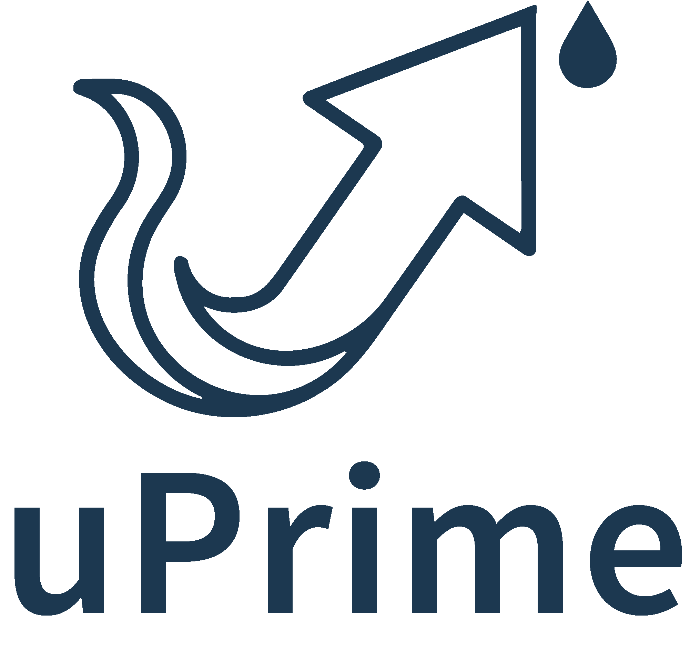
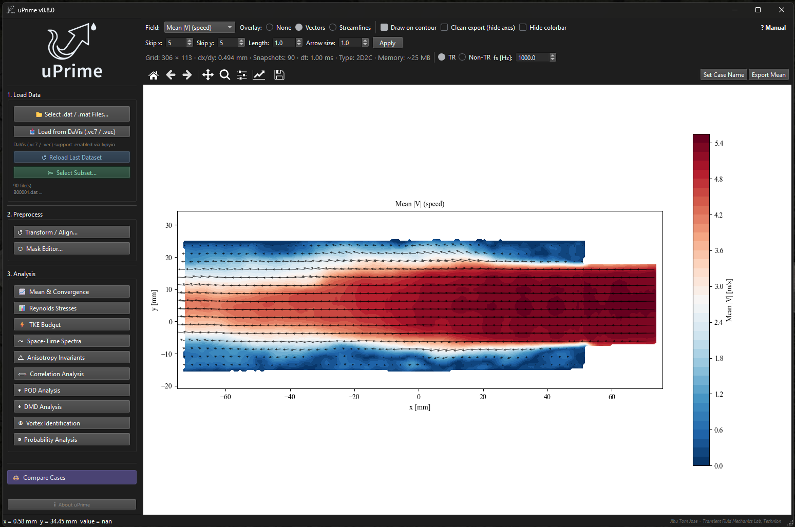
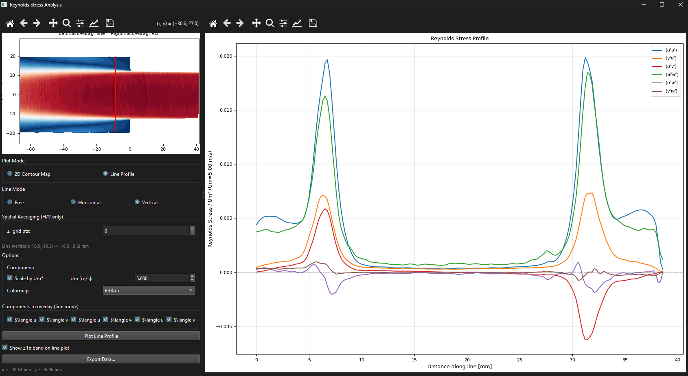
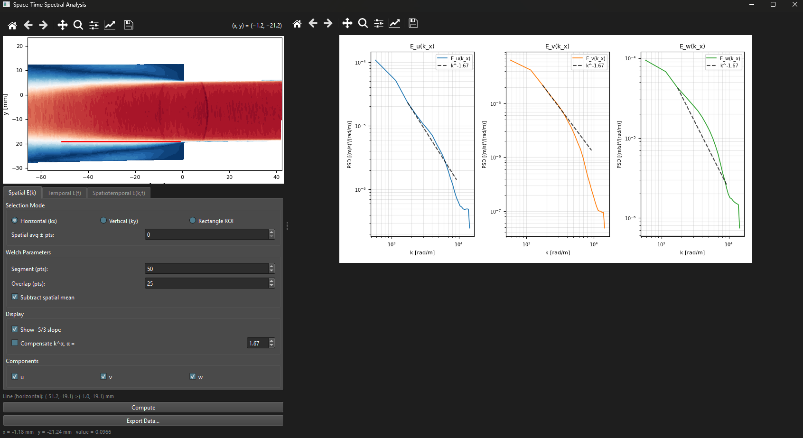
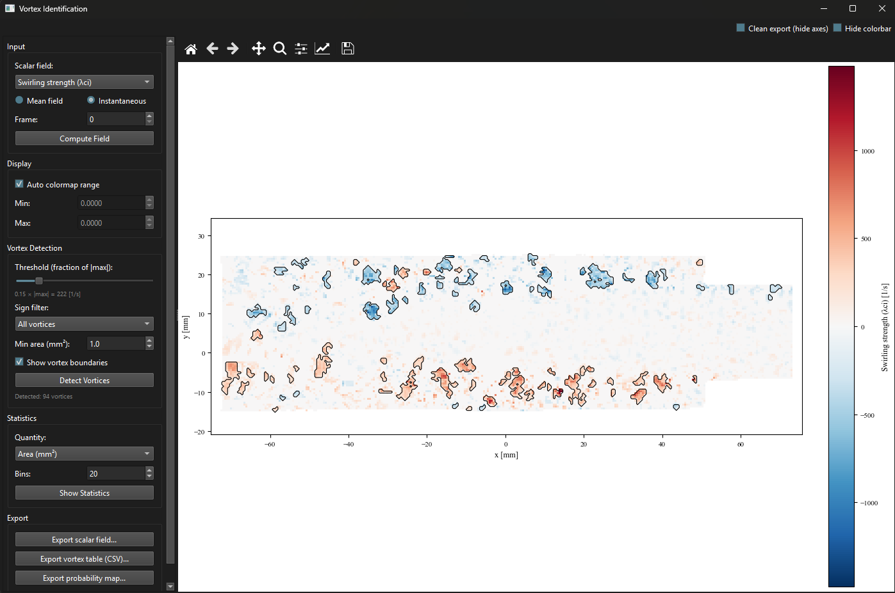

# uPrime

[](https://doi.org/10.5281/zenodo.19376184)


### *Turbulence is complex. Analysis shouldn't be.*

<p align="center">
  <picture>
    <source media="(prefers-color-scheme: dark)" srcset="assets/logo_dark.png">
    <source media="(prefers-color-scheme: light)" srcset="assets/logo.png">
    
  </picture>
</p>

<p align="center">
  
</p>

**uPrime** is a standalone desktop application for post-processing and turbulence analysis of velocity field data from PIV and CFD. It provides a unified graphical interface covering the full range of standard turbulence diagnostics — from Reynolds stresses to DMD — without requiring any scripting or programming knowledge.

Originally developed for Particle Image Velocimetry (PIV), uPrime is equally applicable to CFD and other structured velocity datasets. It is designed to handle large, high-resolution, and time-resolved datasets commonly encountered in modern fluid mechanics research.

Currently supports **planar (2D2C)** and **stereo (2D3C)** velocity fields.

---

## 🚀 Installation

### Windows (recommended)

Download the latest executable from:
https://github.com/CmdrRyder/uPrime/releases

No installation required. Double-click to launch.

> Windows Defender may flag the `.exe` on first run. Click **More info → Run anyway**.

---

A standalone executable is not currently available for macOS or Linux. Run directly from source instead: 
### macOS — Run from source

```bash
git clone https://github.com/CmdrRyder/uPrime.git
cd uPrime
python3 -m venv venv
source venv/bin/activate
pip install -r requirements.txt
python main.py
```

> If you see a Qt platform plugin error on first run, try: `pip install PyQt6`

---

### Linux (Ubuntu/Debian) — Run from source

```bash
sudo apt install python3-dev libgl1-mesa-glx libglib2.0-0
git clone https://github.com/CmdrRyder/uPrime.git
cd uPrime
python3 -m venv venv
source venv/bin/activate
pip install -r requirements.txt
python main.py
```

> If pyfftw fails to install, uPrime falls back to numpy FFT automatically. Install everything else and skip it if needed.

### Run from source (Windows)

```bash
git clone https://github.com/CmdrRyder/uPrime.git
cd uPrime
pip install -r requirements.txt
python main.py
```

---

## ⚡ Quick Start

1. Launch uPrime
2. Select `.dat` files -- a subsampling dialog appears for large datasets
3. Set **Time-Resolved** or **Non-TR** and enter $f_s$ if TR
4. Apply **Transform / Align** to correct camera tilt and shift origin
5. Draw masks in **Mask Editor** if needed
6. Open any analysis module from the sidebar

---

## 🔬 Analysis Modules

| Module | Description | TR required |
|---|---|---|
| Mean & Convergence | Mean velocity line profiles; point-wise statistical convergence (Welford, N* detection) | No |
| Reynolds Stresses | All $R_{ij}$ components, 2D maps, line profiles | No |
| TKE Budget | Production, convection, diffusion, residual | No |
| Space-Time Spectra | Spatial E(k), temporal E(f), space-time E(k,f) | Temporal tabs only |
| Anisotropy Invariants | Lumley triangle, barycentric map | No (stereo only) |
| Correlation Analysis | Two-point spatial and temporal correlations, integral scales | Temporal tab only |
| POD Analysis | Energy spectrum, spatial modes, temporal coefficients, reconstruction | No |
| DMD Analysis | Frequency–growth rate spectrum, spatial mode viewer | **Yes** |
| Vortex Identification | ω, Q, λci, λ2, Γ1/Γ2, per-vortex statistics | No |
| Compare Cases | Standalone viewer: overlay up to 6 datasets (1D profiles + tiled 2D fields) | No |
| Probability Analysis | PDFs of velocity/fluctuations, forward/reverse flow probability maps, binary space-time maps, Lu & Willmarth quadrant analysis | Binary space-time only |

---

## ⭐ Key Features

- **Standalone executable**: no Python or setup required on Windows
- **User-friendly GUI**: no scripting needed -- point and click
- **Non-blocking computation**: all heavy analysis runs in the background; the window stays responsive
- **Large dataset support**: datasets exceeding 4 GB are automatically memory-mapped to disk
- **Non-destructive masking**: draw masks over wall regions, shadows, or reflections without modifying raw data
- **Unit auto-detection**: reads mm/m/s units from `.dat` file headers automatically
- **PIV + CFD compatible**: any structured velocity data in Tecplot ASCII format
- **Compare cases**: standalone viewer overlays up to six datasets (1D profiles + tiled 2D fields); per-module CSV overlay inside analysis windows
- **Probability and quadrant analysis**: velocity PDFs with Gaussian overlay, forward/reverse flow probability maps with detachment-state contours, binary space-time maps, and Lu & Willmarth quadrant decomposition with hole-size sweep
- **Manual line-coordinate entry**: set profile endpoints numerically (x0, y0, x1, y1) for lines reproduced exactly across datasets
- **Publication-ready export**: PNG (300 DPI), PDF, SVG with editable text

---

## 📊 Example Results

### Reynolds Stress

<p align="center">
  
</p>

### Space-Time Spectra

<p align="center">
  
</p>

### Vortex Identification

<p align="center">
  
</p>

---

## 📂 Input Format

uPrime reads **Tecplot ASCII `.dat` files** in DaVis export format:

```
TITLE = "filename"
VARIABLES = "x [mm]", "y [mm]", "Velocity u [m/s]", "Velocity v [m/s]", ... "isValid"
ZONE T="Frame 0", I=NX, J=NY, F=POINT
...data...
```

- One file per snapshot; select multiple files to load a time series
- Variable names and units auto-detected from the header
- Supports 2D2C and 2D3C (stereo) data
- Compatible with **DaVis** (LaVision) and most CFD post-processors

> **Note:** Each `.dat` file should include an `isValid` column (1 = valid, 0 = invalid).
> This is the default DaVis export format. If absent, all vectors are treated as valid
> and a warning is shown.

### MATLAB `.mat` files

uPrime also loads MATLAB `.mat` files (classic v5/v7 and HDF5-based v7.3):

- **Multiple snapshots required.** Single-snapshot files are detected from metadata and rejected with a clear error before any data is loaded.
- **Variable confirmation dialog** is shown on every `.mat` load. Auto-detected variable names are pre-filled; adjust any dropdown if needed and click **Load** to confirm.
- **Coordinate arrays** may be 1D vectors `(Nx,)` / `(Ny,)` or 2D meshgrid arrays in either `(Ny, Nx)` or `(Nx, Ny)` orientation. Transposed arrays are auto-corrected; square grids use a variance heuristic to determine orientation. A status-bar note is shown when a transpose is applied.
- **Large file performance:** The variable dialog appears immediately (metadata only). For v7.3 (HDF5) files the progress bar advances snapshot-by-snapshot. For classic `.mat` files a busy indicator is shown with the file size, since the read is a single blocking call.
- Velocity arrays must have MATLAB shape `(Ny, Nx, N_snap)`. Stereo `w` and `isValid` are optional.
- **Storage precision:** By default uPrime loads `.mat` files as float32 (single precision), matching the `.dat` loader. For files larger than 5 GB the variable confirmation dialog offers a float16 (half precision) option that halves memory usage, allowing files that would otherwise not fit in RAM to load. Float16 has only ~3 decimal digits of precision, and all subsequent computations (Reynolds stresses, TKE budget, POD, DMD, FFT) run at this reduced precision. Fluctuation-based statistics are particularly vulnerable to catastrophic cancellation. Use float16 only for preliminary inspection or mean-field viewing. For final results, reload with the default float32 mode.
- **Mask convention:** uPrime expects `isValid` to follow the "1 = valid, 0 = invalid" convention. If your `.mat` file uses the opposite convention (e.g. a variable named `Mask` where 1 means "mask this out"), select **"1 = invalid (mask out)"** in the **Mask convention** dropdown next to the isValid selector in the variable confirmation dialog. The loader applies the chosen convention with no auto-detection. After loading, the status bar warns if the resulting masked fraction looks extreme (< 5 % or > 95 %); if this fires unexpectedly, reload with the other convention.

### DaVis support (optional)

uPrime can load LaVision **DaVis** vector data — **`.vc7` / `.vec` vector files only** (one field per file; select multiple files for a time series) — via the [`lvpyio`](https://www.lavision.de/en/downloads/software/python_add_ons.php) library. `.set` files and DaVis images (`.im7` / `.imx`) are **not** supported; export or convert a `.set` to `.vc7`. This support is **optional** and **off by default**, because `lvpyio` is a **separately-licensed LaVision library** ("Free To Use But Restricted") and is **not GPL** — it is never bundled into a public release.

**Read this before expecting DaVis loading to work:**

- **The public release `.exe` does NOT include DaVis loading.** The **Load from DaVis (.vc7 / .vec)** button is present but disabled.
- **A separately-installed `lvpyio` will NOT be picked up by the public `.exe`.** A frozen PyInstaller executable only sees packages bundled at build time, not your system's `pip`-installed packages. So `pip install lvpyio` will **not** enable DaVis in the public exe.
- DaVis support is available **one way only**: **run uPrime from source** with
  `lvpyio` installed:
     ```bash
     pip install -r requirements.txt
     pip install -r requirements-lvpyio.txt   # installs lvpyio (restricted licence)
     python main.py
     ```
- DaVis files: select **multiple `.vc7` / `.vec` files** (one per snapshot); they are stacked in natural filename order (`B0001, B0002, … B0010`). A single file is one snapshot and is rejected, like single-snapshot `.mat` files. All files must share the same grid, axes and components (2D2C/2D3C) or the load aborts naming the offending file.

---

## 🧪 Sample Dataset

A sample dataset is available for testing and evaluating uPrime workflows.

🔗 **Download from Zenodo:**
https://doi.org/10.5281/zenodo.19539711

Includes:
- **One non-time-resolved stereo PIV dataset (2D3C)** — 100 snapshots. Suitable for Reynolds stress, TKE budget, correlation, anisotropy, POD, and vortex identification.
- **One time-resolved planar PIV dataset (2D2C)** — 200 snapshots. Suitable for temporal spectra, temporal correlation, TR-POD, and DMD.

Both datasets load directly into uPrime without any configuration.

> ⚠️ **Dataset Usage Notice:** provided strictly for testing and evaluation of uPrime.
> Must not be used for research, publications, or redistribution without explicit
> permission from the authors.

---

## 📘 Documentation

📄 [uPrime User Manual (PDF)](docs/Manual.pdf)

Covers all modules with governing equations, step-by-step instructions, and references.

---

## 🧪 Running Tests

A pytest suite is included covering all core modules and GUI smoke tests:

```bash
py -3.11 -m pytest              # all 68 tests
py -3.11 -m pytest -k "not GUI" # core modules only
py -3.11 -m pytest -k "GUI"     # GUI smoke tests only
```

Tests run headlessly (Agg backend + offscreen Qt) with no real `.dat` files required.

---

## 🧠 Development Status

uPrime is under active development (**v0.8.0 alpha**).
Core analysis modules are stable. Performance and usability improvements ongoing.

---

## 🛣️ Roadmap

- [ ] Vortex tracking across snapshots
- [ ] Phase averaging
- [ ] Pressure field reconstruction from PIV
- [ ] SPOD
- [ ] Virtual probe (point extraction and time series)
- [ ] macOS / Linux builds
- [ ] Tomographic PIV support
- [ ] FTLE / LCS

---

## 📖 Citation

If uPrime contributes to your research, please cite:

> Jibu Tom Jose, & Ram, O. (2026). *uPrime: Open-source software for velocity field and turbulence analysis from PIV and CFD data*. TFML, Technion (v0.8.0-alpha). Zenodo.
> https://doi.org/10.5281/zenodo.19376184

---

## 📜 License

GNU General Public License v3.0 (GPLv3).
https://www.gnu.org/licenses/gpl-3.0.en.html

---

## 👤 Author

**Jibu Tom Jose**
Postdoctoral Research Fellow
Technion — Israel Institute of Technology

Built with assistance from [Claude](https://www.anthropic.com) (Anthropic).
